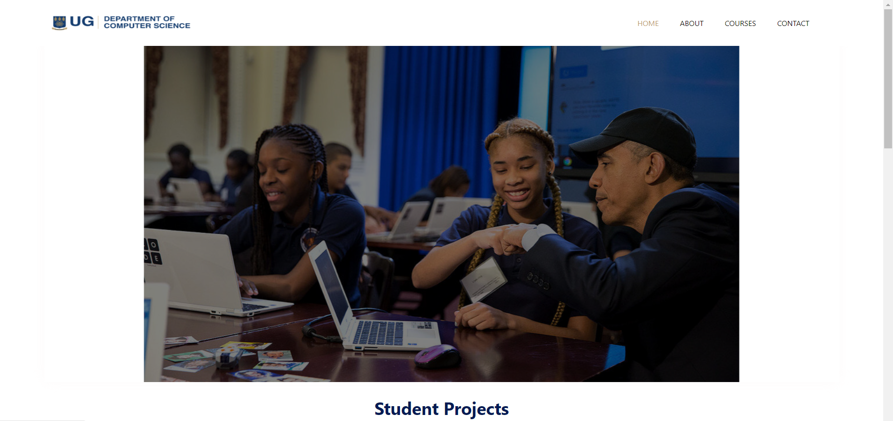
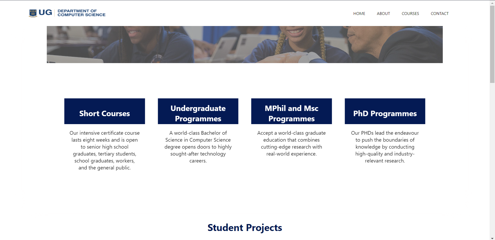
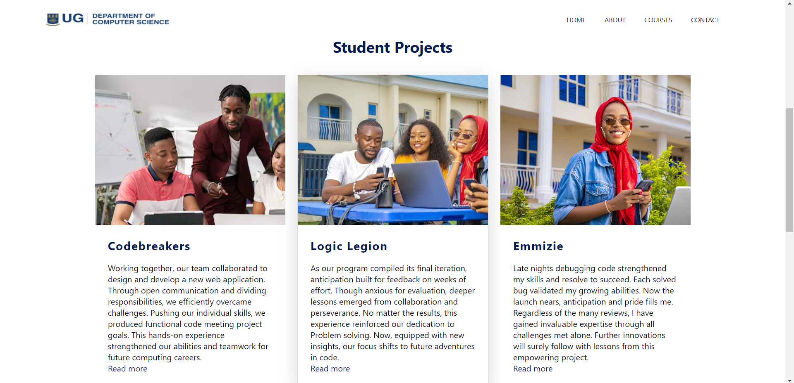
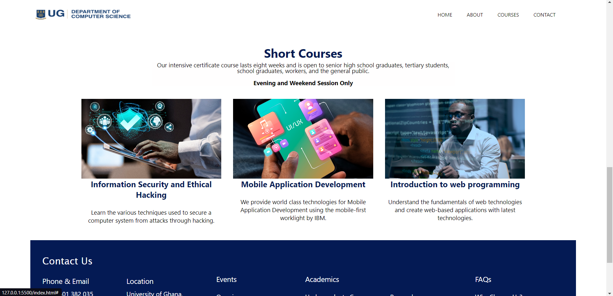
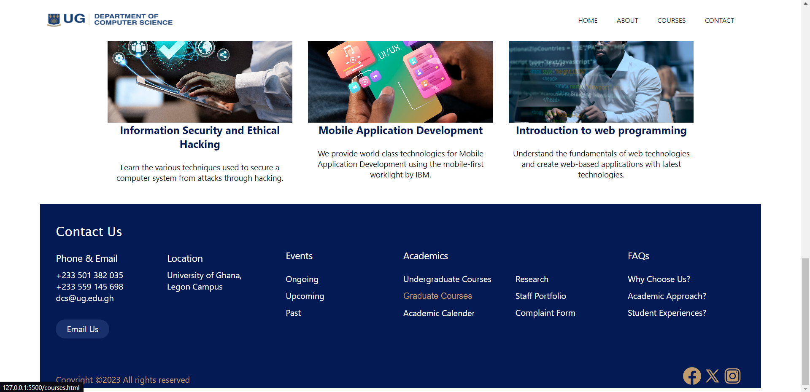

##### DCIT_205_IA
# Building a Computer Science department website.
  

This website was created as a school project to redesign or improve the existing website of the Computer Science department at University of Ghana. It documents  the process of designing and developing a website for the computer science department. 

# Purpose

The purpose of the website is to be the online presence and hub of information for all things related to the Computer Science department to current students, faculty, and visitors about the department's details. This project is aimed at allowing us students apply our web development skills in a practical context and showcase our understanding of computer science resources.

# Overview

The website will provide key information about the department's academics, research and faculty. Core sections will include;
- Homepage
- About
- Courses
- Research areas
- Events
- Contact
- Student Projects
- Staff Portfolio
- Short Courses
- Frequently Asked Questions

# Setup Instructions

1.  Navigate to the repository page on GitHub;
      <https://github.com/Gitzarae/11014893_DCIT205>

2. Click the green **Code** button on github and copy the URL for the repository.

3. Open your terminal or command prompt and change directories to the location where you want to clone the repository: 
           `cd Documents/Projects`

4. Run the git clone command and paste the URL:
 `git clone <https://github.com/Gitzarae/11014893_DCIT205>`

5. The project files will be cloned to a folder called **11014893_DCIT205** locally.

6.  Change to the directory where you want the cloned project to be located: 
`cd 11014893_DCIT205`

7. To check if it cloned successfully, type `git remote -v` which will show the origin URL.

8. You now have the full project code on your machine. To keep it synced with commits on GitHub, type `git pull` to fetch updates.

9. You can view files, run the website and make changes like any local project.

# Author

- Name: Adizatu Kubra Mohammed
- Student ID: 11014893

# Screenshots

These are the screenshots of the pages of the core sections. The screenshots demonstrate the final result of each page.

### Homepage: 
The homepage can be found on the nav bar at the header section.

 

### About: 
The *about* can be found on the nav bar at the header section.

.png)
.png)
.png)
.png)
.png)

### Courses: 
The *courses* can be found on the nav bar at the header section.

.png)
.png)
.png)
.png)
.png)

### Contact: 
The *contact* can be found on the nav bar at the header section.

.png)
.png)
.png)

### Student projects: 
The *student projects* can be found on the homepage.

.png)
.png)
.png)
.png)

### Short courses: 
The *short courses* can be found on the homepage.

.png)
.png)
.png)
.png)

### Events: 
The *events* can be found in the footer at the end of each page.

.png)
.png)
.png)
.png)
.png)

### Research: 
The *research* can be found in the footer at the end of each page.

.png)
.png)
.png)
.png)
.png)

### Staff Portfolio: 
The *staff portfolio* can be found in the footer at the end of each page.

.png)
.png)
.png)
.png)
.png)
.png)

### FAQs: 
The *FAQs* can be found in the footer at the end of each page.

.png)
.png)
.png)
.png)

# Lessons learned

This project provided me with the opportunity to get more knowledge and skills in the planning and design of a multi-page website utilising HTML and CSS through regular research to study new skills. I gained insights into essential aspects such as employing proper semantics, and implementing effective layout techniques. A few challenges met was incoperating new skills learned into my project which took a number of tries to finally succeed. The process of developing this website enhanced my abilities in project management, front-end development, and designs including hovering effects offering valuable lessons that I can readily apply to upcoming projects. In summary, creating a functional website from inception to completion was a highly beneficial and enlightening learning experience.

